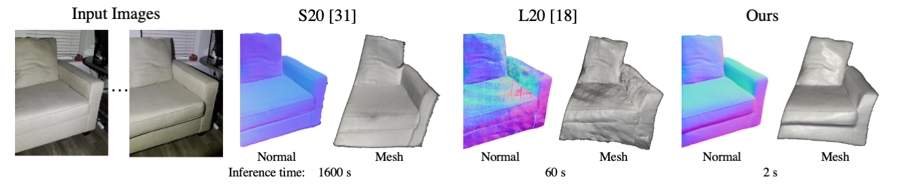

# **[Fast Light-Weight Near-Field Photometric Stereo, CVPR 2022](https://dlichy.github.io/fastNFPS.github.io/)**.
[Daniel Lichy](http://www.cs.umd.edu/~dlichy/), [Soumyadip Sengupta](https://homes.cs.washington.edu/~soumya91/), [David Jacobs](http://www.cs.umd.edu/~djacobs/)


<!--<figure class="image">
  
  <figcaption>{bare-bones capture setup}</figcaption>
</figure>-->

<p>
    
    <!--<em></em>-->
</p>

## Overview

This is the official code release for the paper *Fast Light-Weight Near-Field Photometric Stereo*. 

We provide:
- The trained near-field photometric stereo model and lighting calibration model.
- Code and synthetic data to train these models.
- Code to test on the LUCES dataset.
- Code to test on our dataset from the paper and your own dataset.


## Dependencies
This project uses the following dependencies:

- Python 3.8
- PyTorch
- torchvision
- matplotlib
- numpy
- scipy
- opencv
- OpenEXR (only required for training)
- scikit-sparse (for normal integration post processing)

The easiest way to run the code is by creating a virtual environment and installing the dependences with pip e.g.
```shell
# Create a new python3.8 environment named fastnfps
python3 -m venv fastnfps

# Activate the created environment
source fastnfps/bin/activate

#upgrade pip
pip install --upgrade pip

# To install dependencies 
python -m pip install -r requirements.txt


```


## Test on the LUCES dataset

Download the LUCES dataset from [https://www.toshiba.eu/pages/eu/Cambridge-Research-Laboratory/rm/Luces_dataset.zip] and unzip it.

Then run:
```shell

python eval_luces.py <output_dir> --gpu --checkpoint pretrained_weights/cvpr2022.pth --luces_dataset_root <path to luces data>/data

# To test on LUCES using the lighting calibration network instead of the ground truth light calibration add the arguments --uncalibrated --calib_net_checkpoint
python eval_luces.py <output_dir> --gpu --checkpoint pretrained_weights/cvpr2022.pth --luces_dataset_root <path to luces data>/data --uncalibrated --calib_net_checkpoint pretrained_weights/cal_cvpr2022.pth
```

## Test on our dataset

Download our dataset from [https://drive.google.com/file/d/1_VoPueYtShclhTAu-zxVts18P5R7LaCl/view?usp=sharing] and unzip it.

Then run:
```shell

python eval_standard.py <output_dir> --gpu --checkpoint pretrained_weights/cvpr2022.pth --uncalibrated --calib_net_checkpoint pretrained_weights/cal_cvpr2022.pth --dataset_root <path to our dataset>
```

## Test on your own uncalibrated dataset
The easiest way to test on your own dataset is to format it similarly to our dataset:

dataset_dir:
* sample_name1:
  * image1.jpg
  * image2.jpg 
  * frame3.jpg
  * mask.png
  * intrinsic.txt
* sample_name2:
  * ...


For an example of formating your own dataset please look at our dataset

Then run:
```shell
python eval_standard.py <output_dir> --gpu --checkpoint pretrained_weights/cvpr2022.pth --uncalibrated --calib_net_checkpoint pretrained_weights/cal_cvpr2022.pth --dataset_root <path to your dataset>
```


## Training
Download our synthetic data from [https://drive.google.com/file/d/1ofQrSup0BrZKs456SuMZW84yBbIP1jrq/view?usp=sharing] and unzip it.
Download the MERL BRDF dataset from [https://cdfg.csail.mit.edu/wojciech/brdfdatabase].


To train the main network from scratch run:
```shell
python train.py <log_dir>  --gpu --syn_dataset_root <path to our synthetic dataset> --merl_path <path to merl dataset> --batch_size 8 --num_train_lights 10
```

To train the calibration network from scratch run:
```shell
python train_calibration_net.py <log_dir> --gpu --syn_dataset_root <path to our synthetic dataset> --merl_path <path to merl dataset> --batch_size 16 --num_train_lights 10
```


## FAQ
#### Q1: What should I do if I have problem running your code?
- Please create an issue if you encounter errors when trying to run the code. Please also feel free to submit a bug report.


## Citation
If you find this code or the provided models useful in your research, please cite it as: 
```
@inproceedings{lichy_2022,
  title={Fast Light-Weight Near-Field Photometric Stereo},
  author={Lichy, Daniel  and Sengupta, Soumyadip and Jacobs, David W.},
  booktitle={CVPR},
  year={2022}
}
```

### Acknowledgement 
* Code for the lighting calibration network is adapted from https://github.com/guanyingc/SDPS-Net

* Code for normal integration and loading the LUCES dataset is adapted from https://www.toshiba.eu/pages/eu/Cambridge-Research-Laboratory/luces
